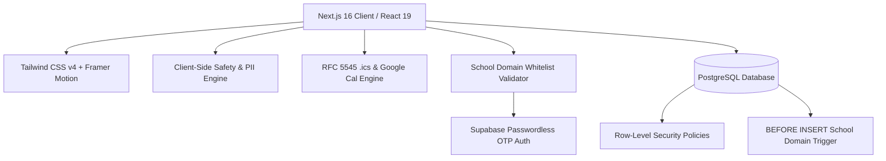

# KantoPrep (関東プレップ)
### Tokyo International School Peer Study & Academic Leadership Network

[-black?style=flat-square&logo=next.js)](https://nextjs.org/)
[](https://react.dev/)
[-3178C6?style=flat-square&logo=typescript)](https://www.typescriptlang.org/)
[](https://tailwindcss.com/)
[-FCC72B?style=flat-square&logo=vitest&logoColor=black)](https://vitest.dev/)
[](https://supabase.com/)
[](https://github.com/amgaa/kantoprep/actions)
[](LICENSE)

> **Founder & Lead Developer:** Amgaa Gantulga  
> **School Affiliation:** Aoba-Japan International School (A-JIS), Tokyo  
> **Target Community:** Tokyo International Schools (IB Diploma, AP, IGCSE, Digital SAT)

---

## 🏆 Engineering Excellence & College Portfolio Highlights

* **102 Comprehensive Automated Tests:** 100% test pass rate across 5 mission-critical test suites (PII safety & academic honesty heuristics, RFC 5545 calendar & deep links, Tokyo school domain anti-spoofing, D-Day exam countdown calculations, and WCAG 2.1 AA dialog accessibility).
* **Modern React 19 Architecture:** Strict render purity with zero `setState`-in-effect cascading renders, robust functional patterns, and idiomatic state management.
* **Production LCP Optimization:** Sub-second asset delivery and Largest Contentful Paint (LCP) performance powered by Next.js `<Image />` optimization.
* **Zero-Warning Codebase:** Automated GitHub Actions CI workflow enforcing zero ESLint warnings, strict TypeScript compilation (`tsc --noEmit`), automated Vitest execution, and production Turbopack builds on every push and pull request.
* **Real-World Community Impact:** Serving students across 10 Tokyo international schools (A-JIS, BST, ASIJ, KIST, St. Mary's, Seisen, ISSH, YIS, Saint Maur, CAJ).

---

## 📖 Executive Summary & Mission

International school students in Tokyo preparing for high-stakes standardized curricula (such as the **International Baccalaureate (IB) Diploma**, **Advanced Placement (AP)**, and **Digital SAT**) face an acute challenge: **academic isolation**. While students across different campuses tackle identical past papers and Internal Assessment (IA) rubrics, no unified, student-governed network exists to facilitate peer collaboration outside commercial tutoring centers.

**KantoPrep** is an open-source, non-profit academic platform built to bridge this divide. It enables verified Tokyo international school students to form syllabus-aligned study pods, coordinate safe in-person sessions at public libraries, share past-paper resources, and automatically verify **CAS (Creativity, Activity, Service)** and **National Honor Society (NHS)** community tutoring hours.

---

## 🌟 Key Features & Innovations

### 1. Zero-Trust School Domain Gatekeeper 
* **Minor Safeguarding:** Unauthenticated visitors are held in a secure, ambient **School Gate Screen**. All study pods, member profiles, and chat rooms are completely hidden until identity verification is satisfied.
* **RFC 5322 Anti-Spoofing:** Strict regular expression and domain normalization verify official school inboxes rejecting generic public providers (`@gmail.com`, `@yahoo.com`) and subdomain spoofing attempts.
* **100% Free 6-Digit OTP:** Powered by passwordless one-time password (OTP) delivery directly to student school inboxes.

### 2. Supercharged Study Pod Chat & In-Room Pomodoro
* **Synchronized 25/5 Study Sprint:** An expandable focus timer allows pod leaders to initiate a 25-minute Pomodoro past-paper sprint with live visual progress bars and room-wide notification broadcasts.
* **One-Tap Transit & Library Status Chips:** Pre-built quick action chips (`👋 Arrived at library!`, `⏳ Running 5 mins late`, `📄 Check Q3 markscheme`) enable rapid mobile communication.
* **Rich Past-Paper Resource Cards:** Students can attach past-paper links (Google Drive, PDFs, IB Docs) that render into interactive, categorized preview cards.

### 3. Meeting Logistics & Calendar RSVP Integration
* **Verified Public Venues Only:** To eliminate child safety concerns associated with residential meetups, sessions are restricted to approved public hubs (Tokyo Metropolitan Central Library in Arisugawa Park, Minato Central Library in Shibakoen, and school library quiet rooms).
* **One-Click Calendar Sync:** Automatically generates Google Calendar deep links and RFC 5545 `.ics` downloads pre-populated with library GPS coordinates, study agendas, and host details.

### 4. Safety & Content Moderation Shield
* **PII Leak Detection:** Scans outgoing chat messages for phone numbers and private addresses, issuing real-time warnings to keep communication on-platform.
* **Academic Dishonesty Defense:** Built-in heuristics identify and block requests to buy/sell unreleased exam papers, test bank leaks, or commercial tutoring solicitation.
* **Anti-Flood Rate Limiting:** Enforces client-level token bucket limits (1.2s message cooldown, 20s pod creation cooldown) to prevent spam.

---

## 🛠️ Technical Architecture & Stack



* **Frontend Framework:** Next.js 16.3 (App Router, Turbopack compiler)
* **Language:** TypeScript 5.0 (Strict mode, zero `any` types)
* **Styling & Design Tokens:** Tailwind CSS v4 (Inline `@theme`, frosted glass utilities)
* **Animation & Motion:** Framer Motion 12.0 + HTML5 Canvas API
* **Backend & Database:** Supabase Free Tier (PostgreSQL 15, Row-Level Security, Database Triggers)
* **Hosting & CDN:** Vercel Global Edge Network ($0/month permanent free-tier architecture)

---

## 🏫 Whitelisted Pilot Schools (Tokyo & Kanto)

| School Name | Domain | Campus Location | Curriculum |
| :--- | :--- | :--- | :--- |
| **Aoba-Japan International School** | `@students.aobajapan.jp` | Hikarigaoka / Bunkyo | IB Diploma (PYP, MYP, DP) |
| **The British School in Tokyo** | `@bst.ac.jp` | Shibuya / Toranomon | A-Levels / IGCSE / GCSE |
| **American School in Japan** | `@asij.ac.jp` | Chofu / Roppongi | Advanced Placement (AP) |
| **K. International School Tokyo** | `@k-international.ed.jp` | Koto-ku | IB Diploma |
| **St. Mary's International School** | `@smis.ac.jp` | Setagaya | IB Diploma |
| **Seisen International School** | `@seisen.com` | Yoga / Setagaya | IB Diploma |
| **Intl School of the Sacred Heart** | `@issh.ac.jp` | Hiroo / Shibuya | Advanced Placement (AP) |
| **Yokohama International School** | `@yis.ac.jp` | Honmoku / Yokohama | IB Diploma |
| **Saint Maur International School** | `@saintmaur.ac.jp` | Yamate / Yokohama | IB Diploma / IGCSE |
| **Christian Academy in Japan** | `@caj.ac.jp` | Higashikurume | AP / American Diploma |

---

## 💻 Local Development & Setup

### Prerequisites
* [Node.js](https://nodejs.org/) v18.18 or newer
* npm v9 or newer

### Installation
```bash
# 1. Clone the repository
git clone https://github.com/amgaa/kantoprep.git
cd kantoprep

# 2. Install dependencies
npm install

# 3. Configure environment variables (optional for local pilot testing)
cp .env.example .env.local

# 4. Start the development server
npm run dev
```

Open [http://localhost:3000](http://localhost:3000) with your browser to experience the platform.

### Production Build Check
```bash
# Verify TypeScript and Next.js Turbopack compilation
npm run build
```

---

## 📜 Academic Integrity & Legal Notice

KantoPrep is committed to the highest standards of international academic honesty:
* **No Test Bank Commercialization:** Buying, selling, or circulating unreleased exam materials is strictly prohibited and leads to immediate account termination.
* **Collaborative Peer Review:** Designed to encourage Socratic discussion, past-paper rubric understanding, and student leadership in full alignment with the IB Learner Profile and standard honor codes.

---

## 👤 Author & Contact

**Amgalanbaatar Gantulga**  
Founder & Developer, KantoPrep  
High School Student, Aoba-Japan International School (A-JIS), Tokyo  
*Email:* [amgaagantulga388@gmail.com](mailto:amgaagantulga388@gmail.com)  
*GitHub:* [github.com/amgaa](https://github.com/amgaa)
